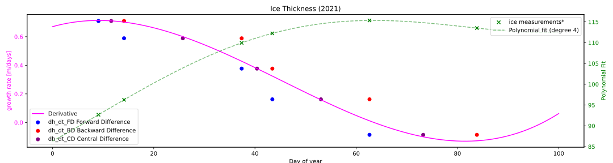

# README for Group Assignment 1.5

*[CEGM1000 MUDE](http://mude.citg.tudelft.nl/): Week 1.5, Friday, Oct 4, 2024.*

Most groups did well, although there are a few minor points listed below. Most notably, _many_ groups did not implement the CD method correctly. Compare your analysis to the solution carefully; you may have also already realized this as part of PA 1.6, which used an assert statement to check that the values of the CD were calculated correctly. Finally, an explanation is provided at the end of this document. 

## Feedback on individual questions

Q1: It does not make sense to compute for the entire year because there is no ice in summer! Therefore, the gradient cannot be calculated over multiple years. Seasonality also would mean the physical process changes, but the point is the absence of ice. Always make sure you think about the meaning of your calculations, rather than proceeding with a numerical scheme blindly. 

Q2: Equidistance is **often** misunderstood for CD approach. Many groups have the wrong number of intervals and/or data points.

Q3: Some groups placed the evaluation point “in the middle”, however the points are not equidistant between the neighboring points (most likely cause was that you found the average of _three_ points, not two).
 
Some groups place it at the days where the measurements are (not equidistant, here the resulting calculation is much further away from the value we intended).
 
Do not forget that CD is second order! This is illustrated below in the example.

Q4: Make sure you know your trigonometry!
Q5: Mostly very good!
Q6: Some forgot to evaluate at $x_0+5$

Q7: Make sure you know your trigonometry! Do not forget to evaluate your derivatives at $x_0= \pi$  and $y_0= \pi$

Q8: Some groups made mistakes in the code, some in the calculation, many various mistakes. Feel free to ask if your graph does not match the solution. See also the explanation below, and PA 1.6.

## Feedback on Central Difference method

In this assignment we were faced with a situation where we wanted to calculate the numerical derivatives for a series of points. These "data" were irregularly spaced, making the application of our typical differentiation schemes a little different than normal, in particular, the _central difference_ method. Note that all three approaches (forward, backward and central) differences assume that every increment of the discretized domain (in this case, time) is equal. In other words, $\Delta t$ is always the same. This is apparent if you follow the derivations in the book (an exercise left for you to practice on your own!).

Actually, since since forward and backward differences use only one time step, there is not problem with the non-uniform increments, as long as you use the $\Delta t$ associated with each data point. However, since CD uses _two_ increments, this approach returns incorrect results.

There are two approaches possible:
1. Re-derive the CD method to take into accound unequal time steps (e.g, $\Delta t_1$ and $\Delta t_2$)
2. Apply the original method at the midpoint between the points. Assume that the numerical derivative is representative of the _midpoint_ between the two points.

We opted for the second approach, as it is very easy to implement. Note also that the computed value of CD with this approach will be exactly the same as the FD and BD for the left and right points, respectively. Yet it is still 2nd order accurate. Magic?! No! See illustration below to see why.

Although the approach of using _three_ points is ok, there are a few problems here:
1. You reduce the number of difference calculations by 1
2. You are averaging over larger time increments, and the function varies a lot (we can't adopt the "normal" approach of making the increments small enough for this not to matter, because we only have a small number of points)
3. Many of those who did this incorrectly applied the computed derivative at the _center_ point, rather than the _midpoint_ of the two outer points, which incorrectly assumes uniform time increments, as described above.

**Why are the values of FS, BD, CD exactly the same, but CD is still 2nd order accurate?** We illustrate this here with a plot that fits a polynomial function to the ice data, then also presents the numerical derivatives calculated for that function (with smaller time steps). Take a look and note the following:

1. The same points used in GA 1.5 are illustrated; FD, BD, CD have same values, again.
2. CD always falls very close to the "true" derivative (the pink line)...because it is more accurate!
3. the difference between the "true" value and the FD and BD approximations increases as the derivative changes more (i.e., as the second derivative increases; this is not plotted). In other words: all methods are accurate for the first increment because the green line is nearly linear (constant value for the true derivative). The opposite is true near the middle and right side of the plot where the derivative is changing rapidly.

**End of file.**

&copy; Copyright 2024 <a rel="MUDE" href="http://mude.citg.tudelft.nl/">MUDE</a>, TU Delft. This work is licensed under a <a rel="license" href="http://creativecommons.org/licenses/by/4.0/">CC BY 4.0 License</a>.