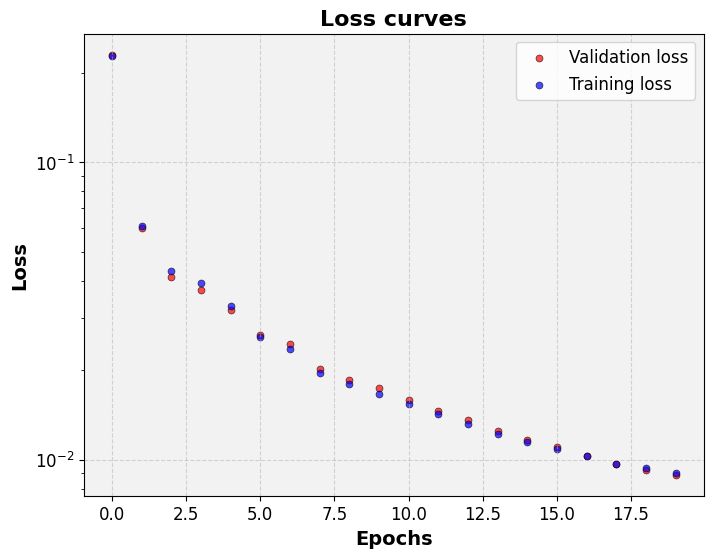
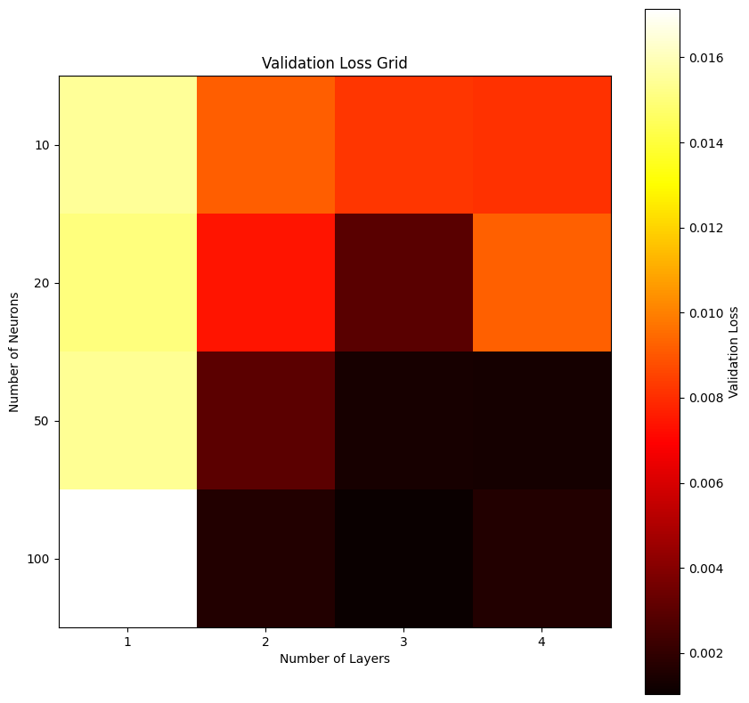
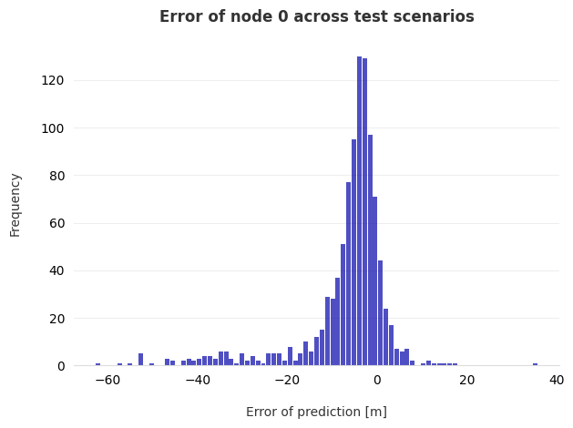

# Project 10 Report: Machine Learning

*[CEGM1000 MUDE](http://mude.citg.tudelft.nl/)*

**SOLUTION**

## Answers to Questions

### Section 1

**1.1) What is the purpose of splitting a dataset into training, validation, and test sets in the context of machine learning?**

The purpose of splitting a dataset into training, validation, and test sets is to ensure that the machine learning model can generalize well to unseen data. The training set is used to train the model, the validation set is used to tune hyperparameters and prevent overfitting, and the test set is used to evaluate the model's final performance.

**1.2) What part of the pre-processing improves the representativity of the overall distribution of the data?**

To ensure that the splitting of the dataset is representative of the overall distribution of the data, shuffling the data helps reducing any bias from the ordering of the data.

**1.3) Why should the `MinMaxScaler` be fitted on the training data only, and then used to transform both the training and validation data?**

The `MinMaxScaler` should be fitted on the training data only to prevent information leakage from the validation set into the training process. If it were fitted on the validation data, it could bias the model towards specific characteristics of the validation set that might not be present in the training data or future unseen data.

### Section 2

Plot the validation and training loss curves. Add this plot to your report.

**2.1) Based on the shape of the loss curves, what can you indicate about the fitting capabilities of the model? (Is it overfitting, underfitting, or neither?)**

Generally:

- If the training loss is low but the validation loss is high, the model is likely overfitting. This means it performs well on the training data but not on unseen data.
- If both the training and validation losses are high, the model is likely underfitting. This means it is not complex enough to capture the patterns in the data.
- If both losses are low and follow a similar trend, the model is likely fitting well. (This is probably our case)

**2.2) How do you explain the difference between the values of training and validation score?**

The training score reflects how well the model fits the data it was trained on. The validation score reflects how well the model generalizes to unseen data. In this case, the validation loss could be slightly lower than the training loss, this is due to the fact that the validation set is smaller than the training set. This means that the validation loss is more sensitive to outliers and noise in the data.

### Section 3
Plot the validation loss grid. Add this plot to your report.

**3.1) How does hyperparameter tuning in machine learning relate to the concept of model complexity?**

Hyperparameter tuning in machine learning is directly related to the concept of model complexity. Hyperparameters control the number of layers in a neural network, the number of nodes in each layer, etc. Adjusting these can increase or decrease model complexity. A more complex model (e.g., more layers or nodes) can capture more complex patterns in the data, but it's also more prone to overfitting. Conversely, a less complex model may not capture all the patterns but can generalize better to unseen data.

**3.2) From the graph, what is the impact of increasing the number of hidden layers on the model's ability to capture complex patterns in the data?**

From the graph, we can see that increasing the number of hidden layers increases the model's ability to capture complex patterns in the data. However, this comes at the cost of increased computational complexity and a higher risk of overfitting.

### Section 4

Plot the distribution of errors. Add this plot to your report.

**4.1) The score indicates a high fitting, is that reflected in the plot of the errors? Why?**

Generally, if the score indicates a high fitting which is reflected in the plot of the errors as the distribution is close to zero. Nevertheless, there are still some outliers that are not captured by the model.

**4.2) Is the the plot of errors centered around zero? If not, what does that mean?**

Ideally, the plot of errors should be centered around zero, which would indicate that the model is equally likely to overestimate or underestimate the true values. Nevertheless, the plot can be off centered, it could mean that the model is consistently overestimating or underestimating the true values. In this case, the plot is skewed to the left, which means that the model is consistently overestimating the true values.

**4.3) How diverse can the speed up values be if you run the cell multiple times? Why?**
The speed up values can vary if you run the cell multiple times due to various factors like CPU load, memory usage, and other processes running on your machine at the same time. However, if the code is deterministic and there are no significant changes in your machine's state, the speed up values should not be very diverse.

**4.4) What would occur with the speed up if you increase the number of neurons in the hidden layers?**
If you increase the number of neurons in the hidden layers, the model will become more complex and will likely take longer to execute. Therefore, the speed up (i.e., the gain in time) would likely be less.

### Section 5
**5.1) What is the minimum that your model predicts for this network?**

The minimum, maximum and mean values that the model predicts for this network are 3.910, 59.634 and 33.755 mwc, respectively. Note that these values can vary as it depends on the model you have trained; for example, in another run the minimum was 16.2 mwc!

**5.2) How confident are you in the prediction of your model? Why?**

We saw that the model had generally a good fit, but there the errors were larger when predicting low pressures, for example. Therefore, we should also be aware that most likely the actual minimum pressure could be lower than the predicted value.

## General Comments on the Assignment [optional]

_Use this space to let us know if you encountered any issues completing this assignment (but please keep it short!). For example, if you encountered an error that could not be fixed in your Python code, or perhaps there was a problem submitting something via GitLab. You can also let us know if the instructions were unclear. You can delete this section if you don't use it._

**End of file.**

&copy; Copyright 2023 <a rel="MUDE Team" href="https://studiegids.tudelft.nl/a101_displayCourse.do?course_id=65595">MUDE Teaching Team</a>, TU Delft. This work is licensed under a <a rel="license" href="http://creativecommons.org/licenses/by-nc-sa/4.0/">CC BY-NC-SA 4.0 License</a>.
