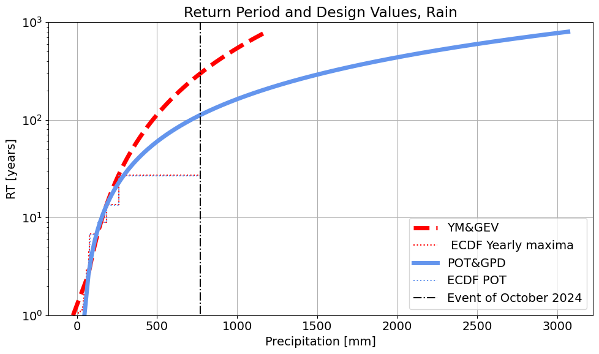

# Group assignment 2.7 Report: Extreme Value Analysis

*[CEGM1000 MUDE](http://mude.citg.tudelft.nl/): January 10, 2025.*

**MUDE TEAM**

## Questions

**1. Provide a short description of your data set.**

The dataset contains cumulative daily precipitation between 1999 and 2024, with a total of 8382 observations. The daily precipitation is a physical magnitude with a lower bound in 0, as seen in the minimum value of the observations, and a maximum of 771mm corresponding to the event of 29th October 2024. This event clearly stands out when plotting the timeseries. The mean value of the precipitation if 1.3mm, with a standard deviation of 10.6mm. Other events that stand out when plotting the timeseries are around the year 2001 and 2021.

**2. Yearly Maxima. How many extremes do you sample? What distribution do you need to use together with the Block Maxima sampling method? Summarize the parameters of this distribution including the tail type. Comment on the goodness of fit of the distribution.**

26 extremes are sampled, since we have data from 26 years. A Generalized Extreme Value distribution is fitted to the values of the random variable obtaining $\xi=0.426$ (note the change in the symbol), $\mu=45.317$ and $\sigma=29.848$. 

Regarding the goodness of fit, it can be seen in the figure above that the distribution overestimates the exceedance probabilities of the observations between approximately 50mm and 125mm and underestimates them for the observations above approximately 125mm. Moreover, the event of October 2024 is totally out of the fitted distribution. Thus, the fitting of the distribution is not satisfactory.

**3. Peak Over Threshold. How many extremes do you sample? What distribution do you need to use together with the POT sampling method? Summarize the parameters of this distribution including the tail type. Comment on the goodness of fit of the distribution. Do you need to add/subtract the threshold when using this method, and if so, at what point in the analysis do you do so?**

38 extremes are sampled whose excesses follow a Generalized Pareto distribution (GPD). When fitting the GPD using MLE, we obtain $\xi=0.714$ and $\sigma = 14.027$. The location $\mu=0$ since we are fitting to the excesses so we should force it in the fitting.

With regard to the goodness of fit, the distribution seems to fit well the observations until values of the random variable up to 300mm. However, the events above, which is only the one from the event of October 2024, is not well fitted and it is totally out of the tail of the fitted distribution.

The threshold is subtracted from the data in the argument of the GPD fitting method (thus fitting the distribution to the excesses). In preparing the plot, note the difference in the 'Analysis_solution.ipynb' between the way the empirical and theoretical CDF are used: the empirical uses the random variable values directly (the DataFrame column at index 1), whereas the GPD "adds the threshold back in" for the random variable value, and uses the excess value as the argument for the CDF.

**4. Comparing the methods. Comment on the differences on the sampled extremes. Comment on the differences you see in the goodness of fit of the distributions from the two EVA Methods (just one or two sentences, using the figures included above). In terms of information used to fit each distribution, are there major differences?**

In this case, POT samples 38 extremes, while YM samples 26 extremes. As expected, POT extracts more information from the timeseries but the difference is not dramatic. Playing with the threshold and declustering time could allow extracting more maxima from the timeseries. However, the largest maxima seem to be sampled by both methods, indicating that the phenomenon we are studying has a yearly seasonality. We could also see that if we compare the ECDFs computed with both POT and YM observations.

Regarding the goodness of fit, the event of October 2024 is not well captured by the distribution by any of the methods. However, the other observations seem to be better described by POT+GPD. This could be due to the larger sample of extremes that are obtained when using POT or due to the shape of the tail of the GPD distribution.

**5. Compare return periods of the event of October 2024 produced by the distributions of the two EVA Methods. Reflect on the differences between the two methods and how to tackle them.You may reflect on:**
- **The source of the differences between both methods.**
- **Which method would be the most reliable in this situation.**
- **If possible, how to improve the reliability of the obtained results.**
- **The meaningfulness of the obtained return periods.**

The return period obtained with YM+GEV is 300.2 years. The return period obtained with POT+GPD is 112.5 years.

- The differences are mainly caused by the shape of the tail of the fitted distributions. As shown in the previous plot, the ECDFs computed from YM and from POT are similar, so no significant differences are observed in the sampled extremes. However, the tail of the fitted GEV and GPD are pretty different, being the GEV much more conservative.  
- Based on the fitting of the GPD distribution to the observations, POT+GPD should be more realiable in this case, although we have not performed any analysis on the threshold and declustering time. Therefore, we would need to ensure that the selected extremes are independent.
- Some possibilities to improve the reliability of the method is gathering more data and performing a formal anaysis to assess the threshold and declustering time of POT. We could also look at different ways of fitting the distribution; here, we fitted the coefficients by MLE but there are other approaches such as Bayesian Inference (makes use of previous knowledge to inform the fitting process) or L-moments method, between others. We could also consider weighting the observations to give more relevance to the larger ones to improve the fitting on those, although we would sacrifice the fitting in the smaller ones.
- It is not possible to know as a ground truth what is the return period of the event. However, it gives us an idea of how extreme it is in comparison with other extremes that ocurred and helps us relativize the magnitude of the event. Also, the fitted distributions allow us to assign return periods to values of the random variable (precipitation) that have not occurred yet.

**6. Which return period would you pick for the event of October 2024? Justify your answer.**

If I were to choose, I'd go for the return period of the distribution that provides a better fitting to the observations, thus the one obtained using POT+GPD.

## General Comments on the Assignment [optional]

_Use this space to let us know if you encountered any issues completing this assignment (but please keep it short!). For example, if you encountered an error that could not be fixed in your Python code, or perhaps there was a problem submitting something via GitLab. You can also let us know if the instructions were unclear. You can delete this section if you don't use it._

**End of file.**

&copy; Copyright 2024 <a rel="MUDE" href="http://mude.citg.tudelft.nl/">MUDE</a>, TU Delft. This work is licensed under a <a rel="license" href="http://creativecommons.org/licenses/by/4.0/">CC BY 4.0 License</a>.
