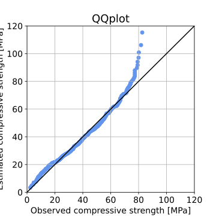

# WS 1.7 Solution

_For some reason the ipynb could not export to HTML, so this file was created to show the figures and code output that is missing from the "real" solution._

## Task 1 Output

<table border="1" class="dataframe">
  <thead>
    <tr style="text-align: right;">
      <th></th>
      <th>0</th>
    </tr>
  </thead>
  <tbody>
    <tr>
      <th>count</th>
      <td>772.000000</td>
    </tr>
    <tr>
      <th>mean</th>
      <td>35.724196</td>
    </tr>
    <tr>
      <th>std</th>
      <td>16.797389</td>
    </tr>
    <tr>
      <th>min</th>
      <td>2.331808</td>
    </tr>
    <tr>
      <th>25%</th>
      <td>23.677591</td>
    </tr>
    <tr>
      <th>50%</th>
      <td>33.870853</td>
    </tr>
    <tr>
      <th>75%</th>
      <td>46.232813</td>
    </tr>
    <tr>
      <th>max</th>
      <td>82.599225</td>
    </tr>
  </tbody>
</table>

## Task 3 Figures

### PDF

### CDF

### PPF

