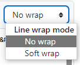

# PA 1.4: MUDE-git-crossword and Ice prediction
*[CEGM1000 MUDE](http://mude.citg.tudelft.nl/): Week 1.5. Due: before Friday, October 4th, 2024.*

## Introduction

You can access the assignment with this link: [classroom.github.com/a/-](https://classroom.github.com/a/-)

This PA consists of 3 parts:

1. Read the chapter in [Programming for Week 1.5](https://mude.citg.tudelft.nl/2024/book/programming/week_1_5.html) about branching, forking, pull requests and merge conflicts
2. Crossword puzzle in this repository with branches and merging into main
3. Contribute to the Ice repo from your own fork

You will pass this PA if:
1. You successfully merged a pull request from your own branch
2. You successfully created a pull request to the ICE repo.

You can verify that you passed the by looking for the green circle in this repository. It runs automatically just like last week when you uploaded your notebook.
For the Ice repository, a green circle should emerge in the pull request you make to the Ice repo.

## Part 2: Crossword puzzle

1. Fill in some words replacing the `-` in `crossword.md` and commit to a separate branch as explained in the book. Tip for editing the crossword puzzle in `crossword.md`: select `no wrap`: 
2. Create a pull request, eventually solve merge conflicts and merge your changes into main
3. Eventually repeat that for multiple words on separate branches. Do you notice when merge conflicts appear?

