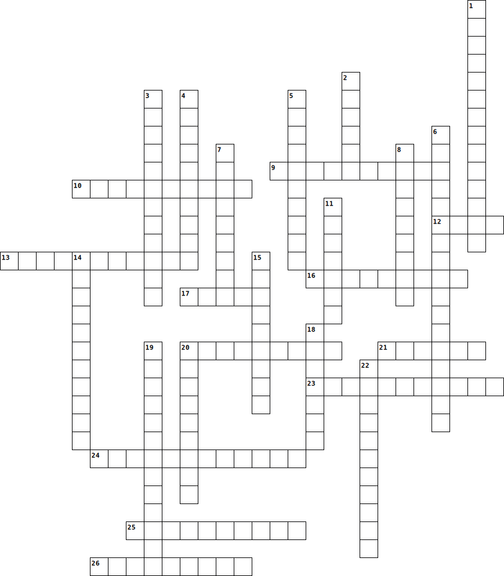

# PA 1.4: MUDE-git-crossword and Ice prediction
*[CEGM1000 MUDE](http://mude.citg.tudelft.nl/): Week 1.5. Due: before Friday, October 4th, 2024.*

## Introduction

You can access the assignment with this link: [classroom.github.com/a/-](https://classroom.github.com/a/-)

This PA consists of 3 parts:

1. Read the chapter in [Programming for Week 1.5](https://mude.citg.tudelft.nl/2024/book/programming/week_1_4.html) about branching, forking, pull requests and merge conflicts
2. Some assignment on your own branch --> merge back to main
3. Fork the ICE repo --> merge back your prediction to main of the ICE repo

### Passing the PA

You will pass this PA if:
1. You successfully merged a pull request from your own branch
2. You successfully created a pull request to the ICE repo.

You can verify that you passed the first part of the assignment by looking for the green circle when you have pushed your commit to your personal repo, it runs automatically just like last week when you uploaded your notebook.
For the second part, a green circle should emerge in the pull request you make to the ICE repo.

### Filling in the crossword
Fill in the words replacing the `-` in `crossword.md` and commit to main

Tip: select `no wrap`:

Across
- (9) Organizational control, 10 letters
- (10) Data analysis, 10 letters
- (12) Information, often numerical, 4 letters
- (13) Earth-related engineering, 11 letters
- (16) Forces and motions, 9 letters
- (17) Potential hazards, 5 letters
- (20) Substances for construction, 9 letters
- (21) Moral principles, 6 letters.
- (23) Upkeep and repair, 11 letters
- (24) Efficiency improvement, 12 letters
- (25) Imitation of operation, 10 letters
- (26) Movement of goods or people, 9 letters

Down
- (1) Long-term viability, 14 letters
- (2) Programming computers, 6 letters
- (3) City development, 12 letters
- (4) Constructed buildings or frameworks, 10 letters
- (5) Fluids in motion, 9 letters
- (6) Combining fields, 16 letters
- (7) Physical behaviors, 9 letters
- (8) Choices made, 9 letters
- (11) Complex networks, 7 letters
- (14) Surrounding natural world, 11 letters
- (15) Available supplies, 9 letters
- (18) Weather patterns, 7 letters
- (19) Information exchange, 13 letters
- (20) Simulating real-world systems, 9 letters
- (22) Lack of sureness, 11 letters
